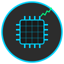

<div align="center">

# COSMIC Monitor Applet



*A Conky-style system monitoring applet for the COSMIC desktop environment*

[](https://opensource.org/licenses/MPL-2.0)

</div>

---

A borderless floating widget that displays real-time system statistics for the COSMIC desktop environment.

## Features

- **Panel Applet**: Integrates into COSMIC panel with a menu to toggle widget and open settings
- **Borderless Widget**: Floating overlay widget using Wayland layer-shell protocol (no window borders!)
- **Dynamic Sizing**: Widget automatically adjusts height based on enabled features
- **Clock Display**: Large time display with 12/24-hour format toggle and date with Conky-style text outlines (toggleable)
- **Weather Integration**: Real-time weather data with dynamic icons (sun, moon, clouds, rain, snow, fog, thunderstorm) from OpenWeatherMap API
- **Temperature Monitoring**: Individual CPU and GPU temperature displays with sensor detection
- **Circular Temperature Gauges**: Color-changing hollow rings for temperature visualization (switchable to text mode)
- **Transparent Background**: Fully transparent widget background for seamless desktop integration
- **Visual Indicators**: CPU, RAM, and GPU icons with gradient progress bars that change color based on usage
- **System Monitoring**: Real-time CPU, memory, GPU (NVIDIA, AMD, Intel auto-detected), storage usage, network, and disk I/O statistics
- **Multi-Vendor GPU Support**: Automatic detection and monitoring for NVIDIA (nvidia-smi), AMD (sysfs/radeontop), and Intel (sysfs/intel_gpu_top) GPUs
- **Storage Monitoring**: Displays disk usage for system drives and external media with intelligent labeling (vendor + model names)
- **Battery Monitoring**: Shows battery status for Logitech wireless devices via Solaar integration with color-coded vertical battery icons
- **Persistent Cache**: Remembers drives and peripherals to instantly display placeholders while loading fresh data
- **Customizable Position**: Precise X/Y positioning via settings window
- **Configurable Display**: Toggle individual stats (CPU, RAM, GPU, clock, date, temperatures), show/hide percentage values
- **Native COSMIC Integration**: Built with libcosmic and follows COSMIC design patterns

## Architecture

This project consists of three separate binaries:

1. **cosmic-monitor-applet**: Panel applet that provides the menu interface
2. **cosmic-monitor-widget**: Borderless widget using direct Wayland layer-shell
3. **cosmic-monitor-settings**: Configuration window for customizing the widget

The widget uses the Wayland layer-shell protocol directly (via smithay-client-toolkit) to bypass COSMIC's window management and achieve true borderless rendering, similar to Conky.

## Building

```bash
# Build all binaries
cargo build --release

# Or build individually
cargo build --release --bin cosmic-monitor-applet
cargo build --release --bin cosmic-monitor-widget
cargo build --release --bin cosmic-monitor-settings
```

## Installation

```bash
# Build all binaries
cargo build --release

# Install using just (recommended)
sudo just install

# Or install manually
sudo install -Dm755 target/release/cosmic-monitor-applet /usr/bin/cosmic-monitor-applet
sudo install -Dm755 target/release/cosmic-monitor-widget /usr/bin/cosmic-monitor-widget
sudo install -Dm755 target/release/cosmic-monitor-settings /usr/local/bin/cosmic-monitor-settings

# Install desktop files and icon
sudo install -Dm644 resources/app.desktop /usr/share/applications/com.github.zoliviragh.CosmicMonitor.desktop
sudo install -Dm644 resources/settings.desktop /usr/share/applications/com.github.zoliviragh.CosmicMonitor.Settings.desktop
sudo install -Dm644 resources/icon.svg /usr/share/icons/hicolor/scalable/apps/com.github.zoliviragh.CosmicMonitor.svg

# Update icon cache
sudo gtk-update-icon-cache -f -t /usr/share/icons/hicolor
```

## Usage

1. Add the applet to your COSMIC panel
2. Click the panel icon to toggle the widget on/off
3. Use "Settings" to configure widget position and displayed stats
4. Enter X and Y coordinates for precise positioning
5. Click "Apply Position" to restart the widget at the new location

## Configuration

Settings are stored using cosmic-config at:
```
~/.config/cosmic/com.github.zoliviragh.CosmicMonitor/v1/
```

Available options:
- **Monitoring**: Toggle CPU, memory, GPU, network, disk stats individually
- **Storage Display**: Toggle storage/disk usage monitoring with per-drive usage bars
- **Battery Display**: Toggle battery section and enable Solaar integration for Logitech wireless devices
- **Temperature Display**: Toggle CPU and GPU temperature monitoring independently, switch between circular gauges and text display
- **Widget Display**: Toggle clock (12/24-hour format) and date displays independently
- **Weather Display**: Toggle weather information, configure OpenWeatherMap API key and location
- **Layout Order**: Customize the order in which sections appear in the widget (Utilization, Temperatures, Storage, Weather)
- **Display Options**: Show/hide percentage values next to progress bars
- **Update Interval**: 100-10000ms refresh rate
- **Widget Position**: Precise X/Y coordinates, auto-start widget on login toggle

## Technical Details

### Why Layer-Shell?

COSMIC's compositor (cosmic-comp) adds a mandatory 10px resize border to all client-side decorated windows. To achieve a truly borderless widget like Conky, we bypass the normal window management entirely using the Wayland layer-shell protocol.

Trade-offs:
- ✅ True borderless rendering
- ✅ Persistent overlay positioning
- ❌ No interactive dragging (position set at startup)
- ❌ No COSMIC theming integration

### Dependencies

- **libcosmic**: For applet and settings UI
- **smithay-client-toolkit**: Direct Wayland layer-shell access
- **cairo-rs/pango**: Custom widget rendering with text outlines
- **chrono**: Date and time formatting
- **sysinfo**: System statistics monitoring
- **solaar**: (Optional) For battery monitoring of Logitech wireless devices
- **cosmic-config**: Configuration persistence
- **reqwest**: HTTP client for weather API requests
- **serde/serde_json**: JSON parsing for weather data

## Weather Setup

To enable weather display:

1. Get a free API key from [OpenWeatherMap](https://openweathermap.org/api)
2. Open Settings from the applet menu
3. Enable "Show Weather"
4. Enter your API key
5. Enter your location (e.g., "London" or "New York")

Weather updates every 10 minutes and displays:
- Current temperature
- Weather description
- Location name
- Dynamic icon based on conditions (clear sky, clouds, rain, snow, fog, thunderstorm) with day/night variants

## Battery Monitoring Setup

To enable battery monitoring for Logitech wireless devices:

1. Install [Solaar](https://github.com/pwr-Solaar/Solaar) if not already installed:
   ```bash
   sudo apt install solaar  # Debian/Ubuntu
   sudo dnf install solaar  # Fedora
   ```
2. Open Settings from the applet menu
3. Navigate to the Battery section
4. Enable "Show Battery Section"
5. Enable "Enable Solaar Integration"

The widget will display:
- Device names (e.g., "G309 LIGHTSPEED", "MX Mechanical Mini")
- Color-coded vertical battery icons (green > 60%, yellow > 30%, orange > 15%, red ≤ 15%)
- Battery percentage next to each device
- Disconnected icon while loading or if device is not available
- Cached device information for instant display on startup

Supported devices: Any Logitech wireless device that Solaar can detect (mice, keyboards, headsets, etc.)

## Cache

The widget caches drive and peripheral information at:
```
~/.cache/cosmic-monitor-applet/widget_cache.json
```

This allows the widget to instantly display disk names and battery devices on startup while loading fresh data in the background. Storage drives show empty bars with "Loading..." and battery devices show a disconnected icon with "Connecting..." until data is refreshed.

## Development

See [ARCHITECTURE.md](ARCHITECTURE.md) for detailed technical documentation and [QUICKSTART.md](QUICKSTART.md) for development setup.

## License

MPL-2.0

## Credits

Built for the [COSMIC Desktop](https://github.com/pop-os/cosmic-epoch) by System76.