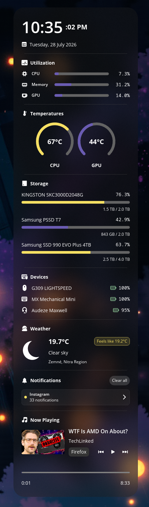

# COSMIC Widget

[Overview](README.md) | [Architecture](docs/architecture.md) | [Supported Devices](docs/supported-devices.md)



A configurable system monitor overlay for the
[COSMIC desktop](https://github.com/pop-os/cosmic-epoch).

[](https://opensource.org/licenses/MPL-2.0)

COSMIC Widget combines a panel applet, a native COSMIC settings application,
and a frosted-glass desktop overlay.

## Features

- CPU, memory, GPU, network, and disk I/O monitoring
- CPU and GPU temperatures with arc, circular, or text displays
- Local and mounted storage usage, including network filesystems
- Native battery monitoring for Logitech peripherals, gaming headsets, and the
  Razer Wolverine V3 Pro 8K PC
- Open-Meteo weather with no API key
- Grouped, expandable COSMIC notifications with synchronized dismissal
- Multi-source media controls for MPRIS players, Cider, Emby, and browser media
- YouTube thumbnails and Bandcamp album covers for browser playback
- Bandcamp track titles in Zen/Firefox when the playing duration uniquely
  identifies a track, without a browser extension
- AI Usage below Now Playing, with Codex and Claude remaining allowances,
  compact temperature-style arches, provider icons, reset times, and report
  details on hover
- Reorderable and individually configurable sections
- COSMIC theming, accent colors, blur, rounded corners, and drag-to-position
- Cached weather, notification, storage, and battery state for fast startup

See [Supported Devices](docs/supported-devices.md) for the complete battery support
matrix.

## Install

The project requires Rust, Cargo, `just`, a COSMIC desktop session, and the
development packages needed by libcosmic and hidapi.

```bash
just build-release
sudo just install
sudo udevadm control --reload-rules
sudo udevadm trigger
```

Reconnect newly supported USB receivers after the first installation so the
udev permissions take effect. The install recipe places the applet, overlay,
settings application, desktop entries, icon, metadata, and headset udev rules
under `/usr/local`.

Add **COSMIC Widget** to the COSMIC panel. Its popup can show or hide the
overlay and open the settings application.

## Run From Source

```bash
cargo run --release --bin cosmic-widget-applet
cargo run --release --bin cosmic-widget-iced
cargo run --release --bin cosmic-widget-settings
```

Only one overlay instance can run at a time.

## Optional Integrations

- [Solaar](https://github.com/pwr-Solaar/Solaar) can be enabled as a fallback
  for Logitech hardware that the native HID++ reader cannot access.
- [HeadsetControl](https://github.com/Sapd/HeadsetControl) can provide fallback
  support for headset models newer than the built-in registry.
- Cider's local API adds direct Apple Music polling and controls. Standard
  MPRIS players work without Cider.
- [COSMIC Files transfer progress](integrations/cosmic-files/README.md) shows copy
  and move progress, then updates the same notification when the operation ends.
  This requires the included COSMIC Files companion and notification timeout patches.
- Codex usage reads the quota snapshots recorded by your local Codex installation
  in `$CODEX_HOME/sessions` (default `~/.codex/sessions`). It checks for updates
  every 30 seconds while enabled and shows each reported quota window, including
  weekly or five-hour limits when available. These are the remaining allowances
  reported by Codex, not estimates from token counts. Usage updates after Codex
  responses; older readings are marked as last known, and elapsed reset times
  wait for a new report.
- Claude usage reads your five-hour and weekly plan allowances using your existing
  Claude Code sign-in. It checks the same usage endpoint as the Claude Code client
  every five minutes, and backs off on request failures. Sign in through Claude
  Code if the widget asks; the widget does not refresh or modify your credentials.
  Older readings are labeled as last known after a failed refresh, and expired
  windows wait for a fresh report.

Toggle or reorder **AI Usage** in the widget settings. Turning it off pauses both
usage monitors. No browser extension is needed.

## Data Locations

Configuration is stored through `cosmic-config` under:

```text
~/.config/cosmic/com.github.zoliviragh.CosmicWidget/v1/
```

Runtime caches are stored under:

```text
~/.cache/cosmic-widget-applet/
```

Cached battery readings are provisional at startup and are replaced by a live
reading or the normal unavailable state.

## Development

```bash
cargo fmt --all -- --check
cargo test --all-targets
cargo clippy --all-targets
```

The production overlay is implemented by the `cosmic-widget-iced` Cargo target
and installed as `cosmic-widget`. The older Cairo target remains in the source
tree under `src/legacy/` as migration compatibility code. All four binaries use
the shared library in `src/lib.rs`; `src/bin/` contains only their launchers.
Monitoring code lives under `src/monitors/`, production UI under `src/overlay/`,
and the applet and settings UI have their own directories. Historical prototypes
and backup snapshots are preserved under `archive/` and are not built.

See [Architecture](docs/architecture.md) for the process model, data flow, and source
layout.

## License

MPL-2.0

Weather icons are from
[Weather Icons](https://github.com/erikflowers/weather-icons) under the SIL OFL
1.1.
